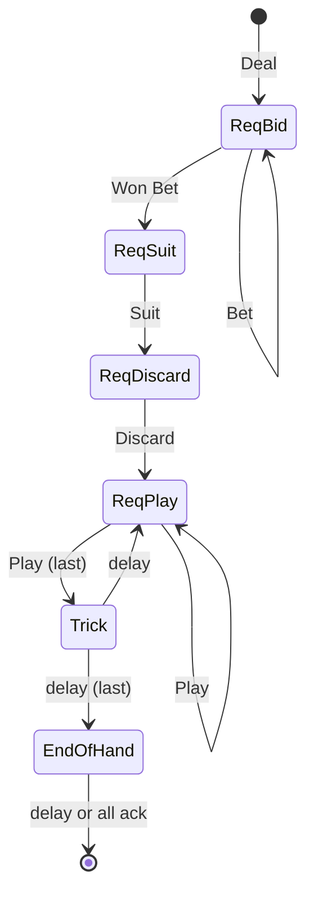

# Definitions

SEATS = 0,1,2,3
TEAMS = 0,1
CARDS = 2H,3S,4D,5C

Table will have a name.
User will have a username.
When a user comes online they will be assigned a session ID

# Lobby Page


Display Tables and Seats
Have a "Sit" button at open seats.
Have an "Add Table" button.

Server will provide updates as other people sit or add tables.

```
[
{
    name: str
    seats: [ username: str, ... ] 
},
...
]
```





# Server to Client

## Hand Update

Sent whenever cards are dealt, played, discarded, etc.
Cards will be pre-sorted

```
hand:{
  cards: [str (card), ...]
}
```

## Table Update

Sent after every action

```
table:{
  trump: str (suit)
  dealer: int (0-3)       (or use seat flag)
  lead: int (0-3)       (or use seat flag)
  seats:[
    {
      hand: int (0-10)
      played: str (card)
      bid: 0-19
      dealer: bool        (or use index)
      lead: bool          (or use index)
    },
    ...
  ]
  score: [int, int]
  points: [int, int]
  deck_cnt: int
}
```

## Log

Sent as a game log for who played what and took tricks, score changes, etc.
Show in a scrolling text box.

```
log:{
  msg: str
}
```

## Dialog

Alert user to problem with ok button (played invalid card, etc.)

```
dialog:{
  msg: str
}
```

## Request Bid

```
req_bid:{
  min: int, 1-18
  max: int, 1-19
}
```

## Request Suit
```
req_suit:{
  suit: str (suit)
}
```

## Request Discard
Only sent if >6 trump cards after taking kitty
```
req_discard:{
  count: int, 1-10
}
```

## Request Play
```
req_play:{
  lead: str (suit)
  trump: str (suit)
}
```

## End of Trick
NOTE: not sure we need this
```
trick:{
  ???
}
```

## Request Deal (End of Hand)

Maybe show dialog with hand results, ask for OK to deal (continue)

```
req_deal:{
  ???
}
```

# Client to Server

## Sit
```
sit:{
  seat: int, 0-3, or null for no seat (stand up)
}
```

## Bid
```
bid:{
  bid: int, 0=pass, 1-18, 19=moon 
}
```

## Suit
```
suit:{
  suit: str (suit)
}
```

## Discard
```
discard:{
  cards: array of str (card)
}
```

## Play
```
play:{
  card: str (card)
}
```

## Deal

```
deal:{}
```