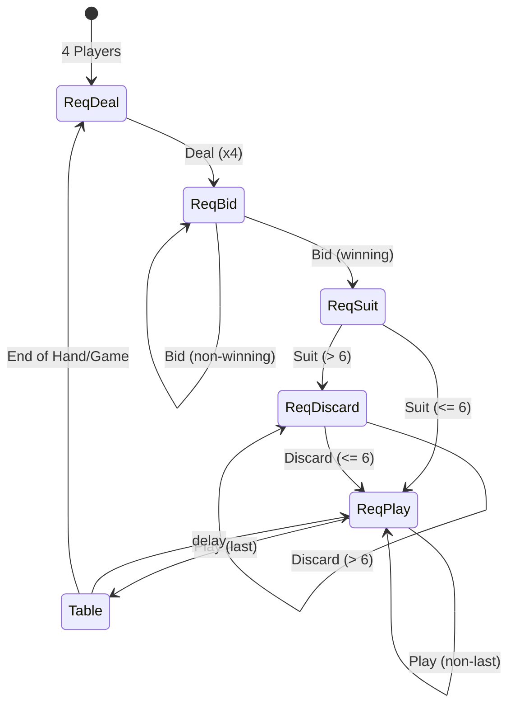

# Definitions

SEATS = 0,1,2,3
TEAMS = 0,1   (0 is seats 0 & 2, 1 is seats 1 & 3)
CARDS = 2H,3S,4D,5C

Table will have a name.
User will have a username.
When a user comes online they will be assigned a session ID

# Lobby Page


Display Tables and Seats
Have a "Sit" button at open seats.
Have an "Add Table" button.

Server will provide updates as other people sit or add tables.

```
[
{
    name: str
    seats: [ username: str, ... ] 
},
...
]
```


# Join a Table

```
POST
url: 'http://<HOST>/table'
data: {
    username: str
    table: str
    seat: str (integer as string)
}
```
This will create a cookie called `Session` to be used with the websocket.

```
namespace: '/table'
headers:{
    Session=<COOKIE_SESSION>
}
```
Upon websocket connection, the client will start receiving data updates and requests.





# Data

## Hand Update

Sent whenever cards are dealt, played, discarded, etc.
Cards will be pre-sorted

```
event: 'hand'
args: {
  cards: [str (card), ...]
}
```

## Table Update

Sent after every action

```
event: 'table'
args: {
  trump: str (suit)
  lead: str (suit)
  bid: int, -1 to 19 (-1=not bid, 0=passed, 1-18=bid, 19=moon)
  
  dealer: int (0-3, none)
  winner: int (0-3, none)
  bidder: int (0-3, none)
  
  deck_cnt: int
  kitty_cnt: int
  
  seats:[
    {
      name: str
      hand: int (0-10)
      played: str (card)
      bid: int, -1 to 19 (-1=not bid, 0=passed, 1-18=bid, 19=moon)
      kept: int (0-10)
      state: int (0=disconnected, 1=ready, 2=waiting)
    },
    ...
  ]
  teams:[
    {
      score: int
      points: int
      cards_won: [ str (card), ... ]
    },
    ...
  ]
}
```

## Score Card

Sent at the end of each hand/game.

```
event: 'score'
args: [
    [ int, int ],
    ...
]
```

# Table

## Add Table

```
event: 'add_table'
args: {
  name: str
}
```

## Remove Table

```
event: 'remove_table'
args: {
  name: str
}
```

## Sit

Automatic on websocket connect.

## Leave

Client sends to server to leave table.

```
event: 'leave'
args: {}
```

## Bots

Client sends to server to fill remaining seats with bots.

```
event: 'add_bots'
args: {}
```

# Dealing

## Request Deal

Server sends to client requesting permission to continue dealing.
This will happen after 4 players are seated,
at the end if the hand, and at the end of the game.

```
event: 'req_deal'
args: {
    scores: [[int,int],...]
    game_winner: None, 0, 1
    points: [int, int]
    point_cards: [[str (card), ...], [str (card), ...]]
    hand_cnt: int
    deck_trump: [ str (card), ... ]
}
```
## Deal

```
event: 'deal'
args: {
  force: bool
}
```
NOTE: force should only be used for debugging purposes

# Bidding

## Request Bid

Server sends when a client need to bid.

```
event: 'req_bid'
args: {
  min: int, 1-18
  max: int, 1-19
}
```

## Bid
Client sends in response to a `req_bid`.

```
event: 'bid'
args: int, 0=pass, 1-18, 19=moon 
```

# Suit Selection

## Request Suit

Server sends to client after winning the bid.

```
event: 'req_suit'
args:
```

## Suit
Client sends in response to a `req_suit`.

```
event: 'suit'
args: str (suit)
```

# Discarding

## Request Discard
Server sends to client only if >6 trump cards after taking kitty.
```
event: 'req_discard'
args: {
    kitty: [ str (suit), ... ]
    cnt: int
}
```

## Discard
Client sends to server to discard a single card.
```
event: 'discard'
args: str (card)
```

# Playing

## Request Play
Server sends to client to request a card to play.

```
event: 'req_play'
args: [ str (card), ... ] 
```

## Play
Client sends to server to play a card.
```
event: 'play'
args: str (card)
```


# Utility

## Log

Sent as a game log for who played what and took tricks, score changes, etc.
Show in a scrolling text box.

```
event: 'log'
args: {
  src: str
  msg: str
}
```

## Dialog

Alert user to problem with ok button (played invalid card, etc.)

```
event: 'dialog'
args: {
  msg: str
  cards: [ str (card), ... ]
}
```


# Admin & Debugging

